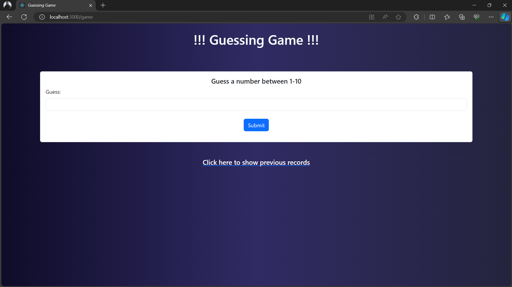

# Guessing Game

Guessing Game is a project made by [Nayem73 (Nayem Mehedi) · GitHub](https://github.com/Nayem73) and [MiNHAZ-33 (MiNHAZ) · GitHub](https://github.com/MiNHAZ-33) collaboratively.

Welcome to our thrilling Guessing Game platform! Are you ready to test your intuition and have some fun? Our Guessing Game is a captivating online challenge that will keep you on the edge of your seat. It’s more than just a game - it’s a battle of wits, a test of intuition, and a great way to sharpen your decision-making skills.

The rules are simple, but the game is anything but. With each guess, you’ll be one step closer to victory or defeat. But remember, it’s all in for fun!

Our website is user-friendly and engaging, designed to provide you with the best gaming experience. Whether you’re a seasoned gamer or a beginner, you’ll find our Guessing Game both challenging and entertaining.

So why wait? Join us now, start guessing, and let the fun begin!

## Simply enter your name in the homepage and let the game begin! No sign in, register or any of that hassle!

## Now just Guess! Not to put too much pressure to your brain, we just kept it simple! Just guess between 1 to 10!

## Proceed with the instructions given and see in how many turns it takes for you to win the game! Oops! the attempts are counting!

## No! it's game over for me! But Can you do better?

